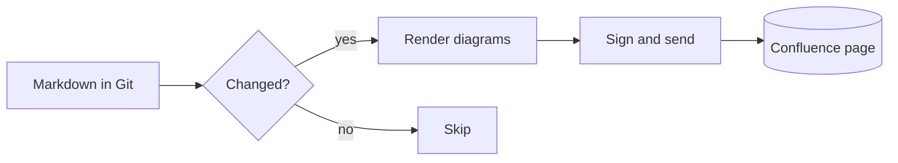
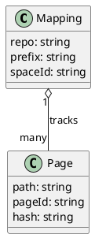

# Diagrams

Mermaid and PlantUML blocks are rendered on the CI runner and attached to the page as SVG. The source stays on the page in a collapsed, searchable block underneath the image, so Confluence search still finds the words inside a diagram.

## Mermaid



## PlantUML



## When a renderer is missing

The GitHub Action brings both renderers. On another runner without Chrome or Java, the push fails before sending anything, so a broken runner can never replace diagrams with code. Use the Docker image `ghcr.io/repopages-app/ci` there, or set `render: off` to publish the blocks as code on purpose.

## A block that does not render

Mermaid rejects this one on purpose. The page shows it as code with a note, the rest of the page is unaffected, and the push still succeeds.

```mermaid
flowchart LR
    A --> B --> ((unbalanced
```
