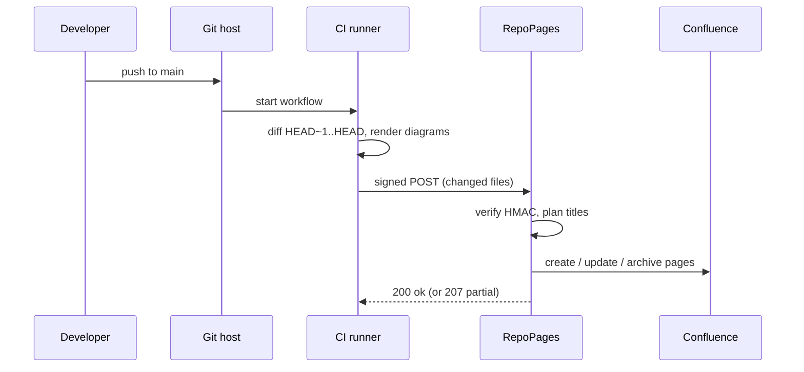

# How the sync works

RepoPages never connects to your Git host. Your CI does the work: it reads the changed files from the commit, signs the payload with the mapping's secret, and sends it to the sync URL. RepoPages verifies the signature and writes the pages.

## What a push contains

| Field | Meaning |
|---|---|
| `repo` | The repository as mapped, `owner/name` |
| `sha`, `ref` | The commit and branch, shown in the page byline |
| `files[]` | Each changed Markdown file with its action: added, modified, removed or renamed |
| `diagrams[]` | SVGs rendered on the runner for the Mermaid and PlantUML blocks in each file |

## What RepoPages does with it

1. **Unchanged content is skipped.** Each page stores a hash of the Markdown it was written from; a file whose hash matches creates no new page version.
2. **Titles come from the document.** Front matter `title`, else the first heading, else the file name. Duplicate titles in a space get the folder path appended.
3. **Folders become parent pages.** `guides/diagrams.md` lands under a "Guides" page; an `index.md` in a folder becomes that folder's page.
4. **Links are resolved.** A relative link to another Markdown file becomes a link to that file's page.
5. **Removals archive.** A deleted file archives its page, with history intact. Nothing is ever deleted.

The whole trip, from merge to updated page, usually takes under a minute, most of it the CI runner starting up.
